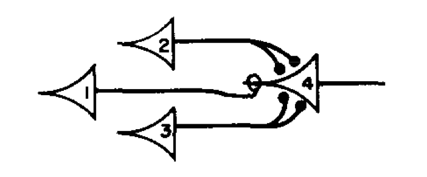
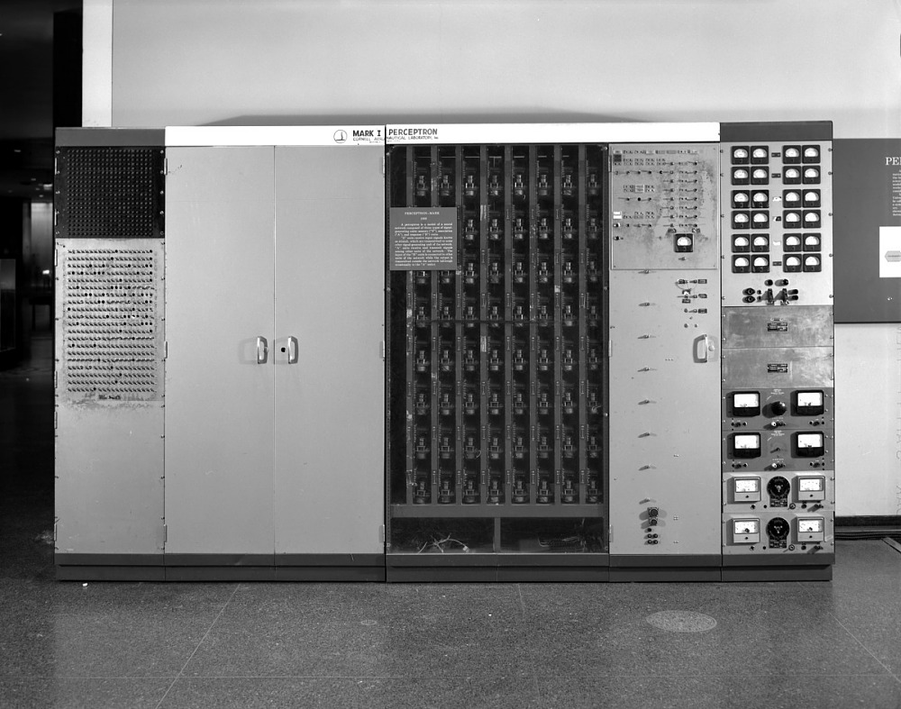
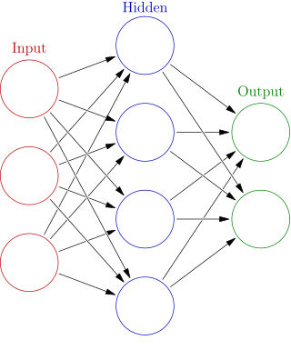
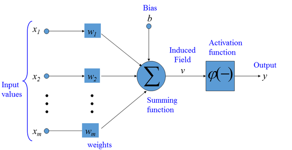
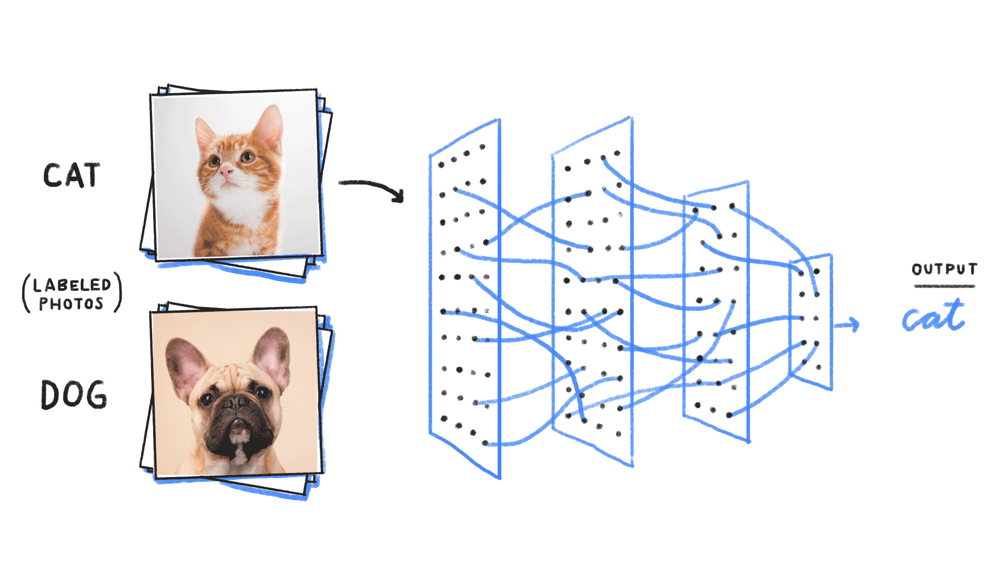
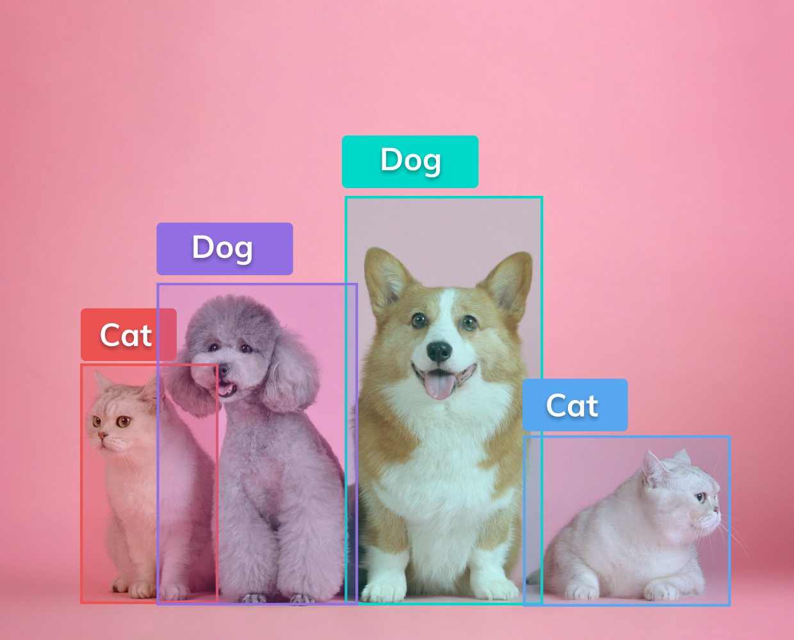
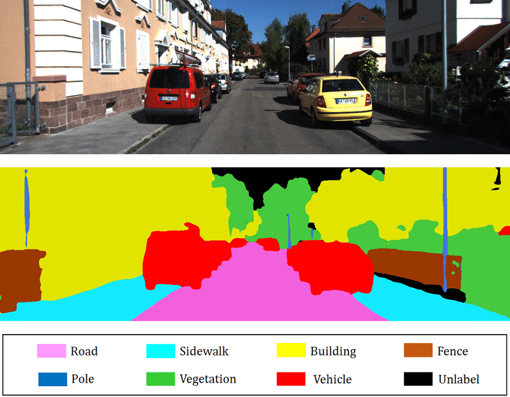
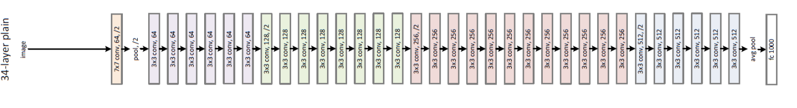
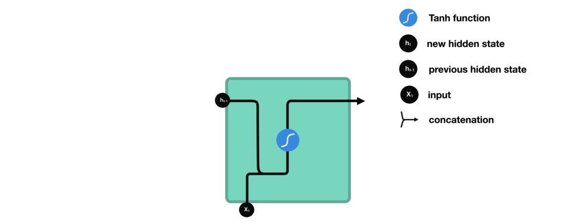
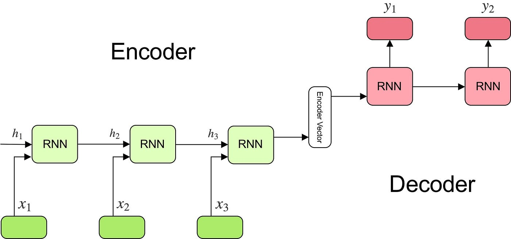

```{r setup, include=FALSE}
knitr::opts_chunk$set(echo = FALSE)
knitr::opts_chunk$set(cache = TRUE)
```


## Introduction to Neural Networks

- Neural nets = fancy regression models  
- Loosely inspired by the human brain
- Composed of interconnected "neurons"  
- In common NNs, each "neuron" is, literally, a GLM!  
- Applied to a wide range of tasks  
- Typically fit by stochastic gradient descent:
  - see a small batch of data  
  - make a small correction to the model based on your errors   
  - keep going until convergence       


## Brief History of Neural Networks

- 1943: McCulloch-Pitts neuron model
- 1958: Perceptron by Frank Rosenblatt
- 1986: Backpropagation algorithm by Rumelhart, Hinton, and Williams
- Late 1990s-2000s: Support Vector Machines and other methods gain popularity
- 2012: Deep learning revolution - AlexNet wins ImageNet competition

{width=40%}


## The Original Perceptron

- Invented by Frank Rosenblatt in 1957
- First implementation: Mark I Perceptron
- Early attempt at creating artificial intelligence
- Designed to recognize simple patterns: a linear binary classifier  

{width=55%}

## Basic Concepts: Neurons

- Basic building blocks of neural networks
- Modeled after biological neurons
- Connected by "synapses" (modeled as weights)
- Each neuron is a GLM:  
  - it computes a linear function of its inputs 
  - it passes the result through an "activation function"  
  - it outputs the result the next neuron(s) 


{height=40%}


## Typical layer structure

- Input layer:
  - Receives input data (features $x$)
  - Number of neurons equals the number of features
  - Passes input data to the first hidden layer
- Hidden layers:
  - Perform transformations on input data
  - Can have multiple layers (deep learning)
  - Each layer has a varying number of neurons  
- Output layer:
  - Produces the final output (predictions $\hat{y}$)
  - Number of neurons depends on the task:
    - Regression: 1 neuron
    - Binary classification: 1 or 2 neurons
    - Multi-class classification: number of classes

## Connecting Layers: Weights and Biases

- Weights ($w$):
  - Connections between neurons in consecutive layers
  - Represented as matrices
  - Example: $W_{ij}$ connects neuron $i$ in layer $l$ to neuron $j$ in layer $l+1$
- Biases ($b$):
  - Offset values added to neuron inputs
  - Represented as vectors
  - Example: $b_j$ is the bias of neuron $j$ in layer $l+1$
- Activation function ($\phi$)  
  - Introduce non-linearity into the network
  - Enable learning of complex patterns
  - Transform the output of a neuron before passing to the next layer
  - Without activation functions, networks would be limited to linear transformations


## What Happens in a Single Neuron

- Input values: $x_1, x_2, \dots, x_n$
- Weights and bias: $w_1, w_2, \dots, w_n$ and $b$  
- Weighted sum: $v = w_1x_1 + w_2x_2 + \dots + w_nx_n + b$  
- Activation function: $\phi$
- Output: $y = \phi(z)$

{height=45%}


## Mathematical Representation of FFNN Architecture

- Initial ("input") layer: $x_1, x_2, ..., x_n$
- Hidden layers: $h_1^{(1)}, h_2^{(1)}, ..., h_m^{(1)}$; $h_1^{(2)}, h_2^{(2)}, ..., h_m^{(2)}$
- Final ("output") layer: $y_1, y_2, ..., y_k$
- Weights: $W^{(1)}, W^{(2)}, ..., W^{(L)}$
- Biases: $b^{(1)}, b^{(2)}, ..., b^{(L)}$

In layer $l$:
$$
\begin{aligned}
z_j^{(l)} &= \sum_{i} W_{ij}^{(l-1)} \mathrm{input}_i^{(l-1)} + b_j^{(l)} \\
\mathrm{out}_j^{(l)} &= \phi(z_j^{(l)})
\end{aligned}
$$

## Common Activation Functions

- Sigmoid: $\phi(x) = \frac{1}{1 + e^{-x}}$
  - Maps input to a value between 0 and 1
  - Historically popular, but can suffer from vanishing gradient problem
- ReLU (Rectified Linear Unit): $f(x) = \max(0, x)$
  - Fast to compute, helps mitigate vanishing gradient problem
  - Most widely used in deep learning
- Tanh (Hyperbolic Tangent): $f(x) = \tanh(x) = \frac{e^x - e^{-x}}{e^x + e^{-x}}$
  - Maps input to a value between -1 and 1
  - Provides stronger gradients than sigmoid
- Softmax: $f_i(x) = \frac{e^{x_i}}{\sum_j e^{x_j}}$
  - Maps input to a probability distribution over multiple classes
  - Used in multi-class classification tasks
  

## Common Activation Functions  

{height=80%}

## Cost Function

- Measures the difference between the predicted output and the actual output
- Objective: minimize the cost function
- Common cost functions:
  - Mean Squared Error (MSE): $\frac{1}{n}\sum_{i=1}^{n}(y_i - \hat{y}_i)^2$
  - Cross-Entropy: $-\sum_{i=1}^{n} y_i \log(\hat{y}_i) + (1 - y_i) \log(1 - \hat{y}_i)$ -- to a statistician, binomial negative log likelihood  
- Choice of cost function depends on problem type and model architecture

## Making Predictions: Forward Propagation

1. Calculate weighted sum:
   - $z_j^{(l)} = \sum_{i} W_{ij}^{(l-1)} a_i^{(l-1)} + b_j^{(l)}$
2. Apply activation function:
   - $a_j^{(l)} = f(z_j^{(l)})$
3. Propagate recursively from input to output layer


## Gradient Descent Optimization

- Algorithm to minimize the cost function
- Adjusts weights and biases iteratively: "intelligent trial and error"  
- Updates are based on the gradient of the cost function with respect to the parameters
- Learning rate: step size for each update  
- Variants: Stochastic Gradient Descent (SGD), Mini-batch Gradient Descent


## Backpropagation Algorithm

- Calculates gradients for weights and biases
- Efficient technique for computing partial derivatives  
- Developed in the early 1960s by multiple researchers
- Key contributors: Henry J. Kelley, Arthur E. Bryson, and Stuart Dreyfus
- Popularized by Rumelhart, Hinton, and Williams in 1986  


## Backpropagation Algorithm

- Chain rule of calculus forms the basis of backpropagation  
- Given a composite function $y = f(g(h(x)))$, the chain rule states:

$$
\frac{dy}{dx} = \frac{dy}{du} \cdot \frac{du}{dv} \cdot \frac{dv}{dx} \quad \mbox{where} \quad u = g(h(x)), \; v = h(x)
$$


- In backpropagation, the chain rule is applied to compute gradients for weights and biases:  
  1. Perform forward propagation to compute the predicted output
  2. Compute the error between predicted and actual output
  3. Calculate gradients for output layer weights and biases
  4. Propagate gradients backward through the network, layer by layer
  5. Update weights and biases using the computed gradients   


## Basic Neural Network Training Loop

Inputs:  
- number of epochs  
- minibatch size  
- learning rate  

Pseudo code:

\scriptsize
```
1. Initialize network parameters (weights and biases)
2. for epoch in range(number of epochs):
3.     Shuffle the dataset
4.     for minibatch in dataset.split(minibatch_size):
5.         Initialize gradients to zero
6.         for sample in minibatch:
7.             Perform forward propagation to compute output
8.             Compute the error between predicted output and actual output
9.             Perform backward propagation to compute gradients
10.            Accumulate gradients for the minibatch
11.        Update network parameters using accumulated gradients:
           W = W - learning_rate * (1/minibatch_size) * sum(gradients)
```

## Common Software Environments  

- There are several popular software environments for training neural networks, including:
    - TensorFlow by Google
    - Keras (a high-level API built on top of TensorFlow)
    - PyTorch by Facebook
    - Others, e.g. Apache MXNet and Microsoft CNTK

- All have their strengths and are widely used in the ML community; I recommend and use **PyTorch** for its:
    - Ease of use and intuitive syntax
    - Dynamic computation graph
    - Strong community support and extensive documentation

PyTorch has become increasingly popular among researchers and practitioners alike.  __It just feels a lot more like writing plain Python than other frameworks.__  

Key downside: it's less efficient as a _production framework._  

## Examples

Let's see two quick examples:

- `basic_nn.ipynb`  
- `classification_nn.ipynb`  

## Convolutional Neural Networks for Images

- Convolutional Neural Networks (CNNs) are a type of deep learning model specifically designed to work with images.
- They can be used for tasks such as:  
  - image classification  
  - object detection  
  - semantic segmentation.
- CNNs were really the start of the modern deep learning revolution!  

## Image Classification

- Assign an input image to one of several predefined categories
- Commonly used for tasks such as digit recognition and scene classification
- Requires a labeled dataset for training

{height=45%}


## Object Detection

- Identify and locate objects within an image
- Provide bounding boxes around each detected object
- Combine image classification with localization techniques
- Useful for applications like autonomous vehicles and surveillance systems

{height=45%}

## Semantic Segmentation

- Assign a class label to each pixel in the input image
- Understand the context of the image at the pixel level
- Useful for tasks like autonomous driving, medical image analysis, and robotics

{height=50%}  

## Convolutional Layers

- Key component of CNNs
- Apply filters to the input image
- Detect features such as edges, shapes, and textures
- Multiple filters allow the network to learn different features

{height=40%}

## Pooling Layers

- Reduce the spatial dimensions of the feature maps
- Make the network more resistant to small changes in input
- Common types: Max Pooling, Average Pooling

{height=30%}


## Fully Connected Layers

- Flatten the feature maps into a single vector
- Perform classification or regression tasks
- Utilize activation functions (e.g., ReLU, softmax) to introduce non-linearity

You've seen these before!  

## Examples of CNN Architectures

- LeNet-5: Early CNN architecture for digit recognition
- AlexNet: Breakthrough architecture, won the 2012 ImageNet competition
- VGGNet: Improved accuracy with deeper networks
- ResNet: Enabled training of very deep networks using residual connections

{height=45%}

## Examples

Let's see a quick example in `MNIST.ipynb`, where we'll train a conv-net to recognize hand-written digits (0-9).  

## Recurrent Neural Networks for Sequences

- Recurrent Neural Networks (RNNs) are designed for sequential data, such as time series, natural language text, and audio signals.  
- They can handle inputs and outputs of varying lengths, making them suitable for tasks like language translation, sentiment analysis, and speech recognition.
- They are no longer cutting edge!  c.2023, best are models based on __transformers,__ another class of models.  Still important to know RNNs.  

## Basic RNN Structure

- Process input sequences one element at a time
- Maintain a hidden state vector to store information from previous time steps
- Update the hidden state as new input elements are processed

{height=50%}


## RNN Math 

An RNN updates its hidden state vector recursively as follows:  

- Input vector: $x_t$
- Hidden state vector: $h_t$
- Weight matrices: $W_{xh}$, $W_{hh}$, $W_{hy}$
- Bias vectors: $b_h$, $b_y$
- Update/predict equations:  
$$
\begin{aligned}
h_t &= \phi(W_{xh} x_t + W_{hh} h_{(t-1)} + b_h) \\
y_t &= \mathrm{predict}(h_t)  
\end{aligned}
$$
- When you learn an RNN, you're learning those weight matrices.  
- You can also stack RNNs to make deeper models.  E.g. layer 2's input is layer 1's output.  

## Sequence-to-Sequence Prediction:

- Encoder processes the input sequence and generates a "context vector", representing everything seen up to that point.  
- Decoder uses the context vector to produce the output sequence, one item at a time.  "Autocomplete on steroids."  
- RNNs can be used for tasks like machine translation, speech recognition, and image captioning.  

{height=40%}

## Challenges with RNNs

- Vanishing gradients: Difficulty in learning long-range dependencies
- Exploding gradients: Numerical instability during training
- One solution: Long Short-Term Memory (LSTM) Networks
  - Solve vanishing gradient problem using memory cells and gating mechanisms
  - Preserve information across long sequences
  - More complex and computationally expensive than basic RNNs
- Another solution: Gated Recurrent Unit (GRU)
  - Simplified version of the LSTM
  - Uses update and reset gates
  - Requires fewer parameters and is faster to train

## GRUs

- Gated Recurrent Units (GRUs) are a type of recurrent neural network (RNN)
- They are designed to help with the vanishing gradient problem that can occur in traditional RNNs
- Like RNNs, GRUs process sequences of input data and use a hidden state to retain information from previous inputs
- However, GRUs have an additional gating mechanism that helps them selectively forget or remember information from the past, making them more efficient and effective than traditional RNNs

## Math of a GRU Unit

- GRUs have two gates, an update gate $z$ and a reset gate $r$, which control the flow of information through the unit.
- The output $h$ is a combination of the previous hidden state $h_{t-1}$ and the current input $x_t$.

The equations for a GRU unit are:

- Update gate: $z_t = \sigma(W_z [h_{t-1}, x_t] + b_z)$
- Reset gate: $r_t = \sigma(W_r [h_{t-1}, x_t] + b_r)$
- Candidate hidden state: $\tilde{h_t} = \tanh(W_h [r_t * h_{t-1}, x_t] + b_h)$
- Final hidden state: $h_t = (1 - z_t) * h_{t-1} + z_t * \tilde{h_t}$

where $W_z$, $W_r$, and $W_h$ are weight matrices, $b_z$, $b_r$, and $b_h$ are bias vectors, and $*$ represents element-wise multiplication.

## Example: sequence reversal

We'll look at a fun example in `seq_to_seq_toy.ipynb`, where we'll train a seq-to-seq model that learns to reverse a given input word.

Specifically, given a sequence of characters from a word with its characters in reverse order, the model should generate the correct forward sequence of characters representing the original word.

For example, if the input is "yekrut", the output should be "turkey":

```
input_seq              => output_seq
y - e - k - r - u - t  => t - u - r - k - e - y
```

## Example: sequence reversal

Of course this is silly!

But the problem our Seq2Seq model will solve, i.e., reversing words, shares similarities with more complex tasks like machine translation and natural language generation, as tackled by models like ChatGPT. 

While the word reversal problem is _much_ simpler, it serves as a stepping stone to understanding the underlying concepts and techniques that apply to those more advanced tasks.

## Key concepts illustrated

- **Encoder-Decoder architecture**: The encoder processes the input sequence and generates a context vector (hidden state) that represents the input. The decoder then takes this context vector and generates the output sequence.

- **Recurrent Neural Networks (RNNs)**: RNNs are suitable for sequence-to-sequence learning tasks because they can handle sequences of varying lengths and are capable of capturing temporal dependencies in the data.

- **One-hot encoding**: The input sequences of characters are represented using one-hot encoding, which is a way to represent categorical variables as binary vectors.  

- **Custom PyTorch Dataset and Data Loading**: The model demonstrates the creation and usage of a custom PyTorch dataset (`ReverseWordDataset`) to handle the loading, encoding, and decoding of training data.

