```{r setup, include=FALSE}
knitr::opts_chunk$set(echo = FALSE)
knitr::opts_chunk$set(cache = TRUE)
```


# Outline


1. Introduction to clustering
2. K-means  
3. Implementing K-means: some practical details  
4. Hierarchical clustering  
5. Spectral clustering  


# Introduction to clustering


You've seen a lot of models for $p(y \mid x)$.  This is _supervised learning_ (knowing outcomes $y$ = "supervision").  

The next few topics are all about models for $x$ alone.  

Today: __clustering__

- Clustering means dividing data points into categories which are not defined in advance.
- It's different from _classification_: dividing data points into categories which _are_ defined in advance, and for which we have explicit labels.   

---

# Clustering: toy example


```{r, echo=FALSE, fig.align='center', out.width='300px', fig.asp = 0.65}
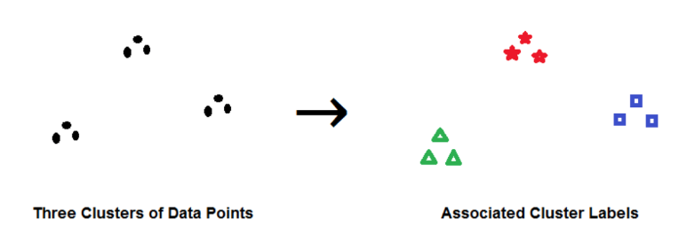
```

- The horizontal and vertical locations of each point give its location $x_i = (x_{i1}, x_{i2}, \ldots, x_{ip})$ in feature space.  
- From these locations, we impute the cluster labels: $\gamma_i = k$ if point $i$ is in cluster $k \in \{1, \ldots, K\}$.   


# Criteria for clustering


Clusters should partition the data:

- Partition = mutually exclusive, collectively exhaustive set of categories (each data point is in one and only one cluster).  
- No "mixed membership."  If you encounter a Chiweenie, you need a new cluster!  

```{r, out.width = "300px", fig.align='center', echo=FALSE}

```


# Criteria for clustering


Data points within the same cluster should be close/similar, and data points in different clusters should be far apart/dissimilar.  

```{r, out.width = "300px", fig.align='center', echo=FALSE}
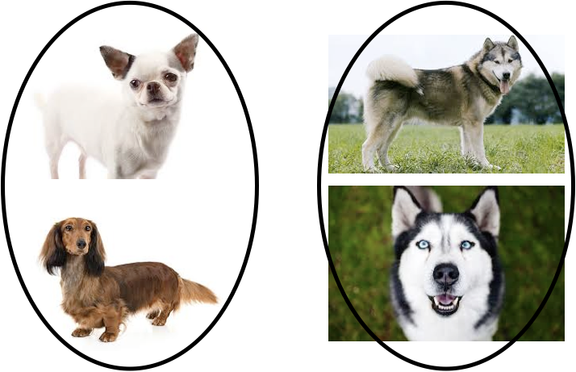
```


# Criteria for clustering


Clusters should (ideally) be balanced.  A sensible clustering of living creatures:  

```{r, out.width = "275px", fig.align='center', echo=FALSE}
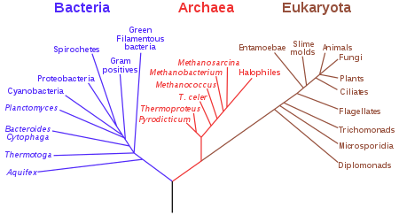
```


# Criteria for clustering


A less sensible clustering of living creatures:  

```{r, out.width = "275px", fig.align='center', echo=FALSE}
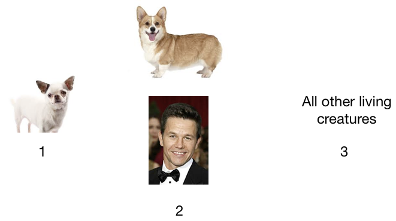
```


# How can we cluster without labels?


There are many algorithms which do this, i.e. try to find clusters that are homogenous, well separated, balanced, etc.  

Key fact: we need to know about distances to quantify similarity (within a cluster) and difference (between clusters).  

Generically, if $x_i$ and $x_j$ are two data points, we let $d(x_i, x_j)$ denote the distance between them.  


# Distance functions

The basic properties of any distance function:

1. $d(x_i, x_j) \geq 0$

2. $d(x_i, x_j) = 0 \iff x_i = x_j$.  

3. $d(x_i, x_j) = d(x_j, x_i)$ (symmetry)  

4. $d(x_i, x_j) \leq d(x_i, x_k) + d(x_j, x_k)$ (triangle inequality, i.e. "If you want to get from Austin to Houston, don't go through Dallas!")  

NB: in math, distance functions are called "metrics."  


# Distance functions


- Euclidean ($\ell^2)$:
$$
d(x_i, x_j) = \left[ \sum_{d=1}^D (x_{id} - x_{jd})^2  \right]^{1/2}
$$
(just the Pythagorean theorem!)  

- Manhattan ($\ell^1)$:
$$
d(x_i, x_j) =  \sum_{d=1}^D |x_{id} - x_{jd}|
$$
(also called "taxicab" distance)  

Let's draw these to fix the intuition.

# Distance functions: let's draw


# Distance functions 


The $x$ points can be arbitrary objects in potentially crazy spaces:

- playlists on Spotify
- phrase counts for books
- DNA sequences 
- etc.  

As long as we can measure the distance between any two points, we can cluster them.  


# A few miscellaneous notes  

Clusters can be ambiguous:

\bigskip

```{r, echo=FALSE, fig.align='center', out.width='275px', fig.asp = 0.65}
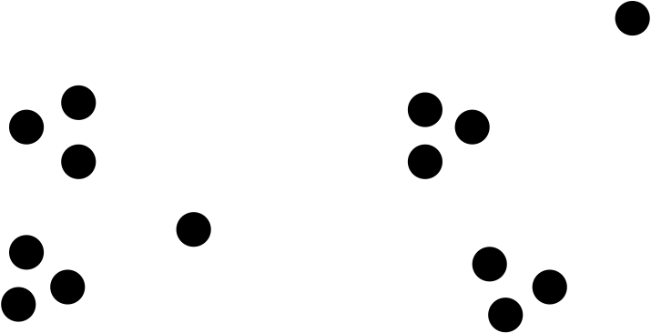
```

\bigskip

How many clusters do you see?


# A few miscellaneous notes  


We can organize algorithms into two broad classes:

1. "hierarchical" clustering methods.  Think the tree of life!  Mammals and reptiles are both vertebrates.  Vertebrates and invertebrates are both animals.  Animals and plants are both eukaryotes.  Etc.  
2. "partitional" clustering methods.  Here there is no tree or hierarchy, just a "flat" set of clusters.  


# A few miscellaneous notes  


Distance-based clustering isn't magic.  

\bigskip

```{r, out.width = "275px", fig.align='center', echo=FALSE}
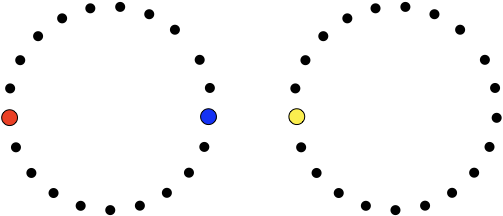
```

\bigskip

Should blue cluster with red or with yellow?

(We can often deal with situations like this by redefining what distance is.  The term here is "manifold learning.")


# K-means clustering


K-means is the most popular, and simplest, partitional clustering approach.

- It's the "OLS of clustering."
- Each cluster is associated with a centroid (center point).  The number of clusters $K$ must be chosen in advance.  
- Each point is assigned to the cluster with the closest centroid.

The two questions with K-means are:  

1. How do we choose $K$.
2. Assuming a choice of $K$, how do we do the clustering?  

We'll treat the second question first, holding off on the first question for now.  


# K-means clustering


The basic algorithm is super simple: 

\bigskip

```{r, echo=FALSE, fig.align='center', out.width='275px'}
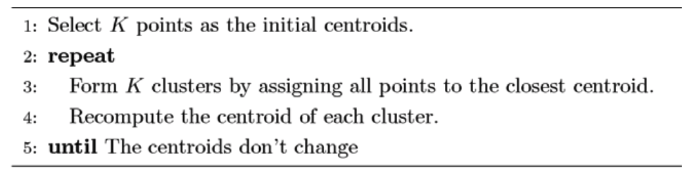
```

\bigskip

__That's it!__ Algorithms don't get any simpler in data science.  


# K-means clustering: some practical details

- The $K$ initial centroids are often chosen randomly. Thus the clusters produced vary from one run of K-means to another.  
- The centroid is (typically) the mean of the points in the cluster (it's K __means__, after all!)    
- Closeness is measured any valid distance function, often (but not always) Euclidean.  
- You usually (but not always) want to scale/normalize your features before running K means.  
- K-means will converge pretty rapidly for these common distance measures.  Most of the convergence happens in the first few iterations.  
- Complexity of each iteration is is $O( n \cdot K  \cdot D)$ where $n$ is the number of data points, $K$ is the number of clusters, and $D$ is the number of features.  


# Two different K-means Clusterings


```{r, out.width = "300px", fig.align='center', echo=FALSE}
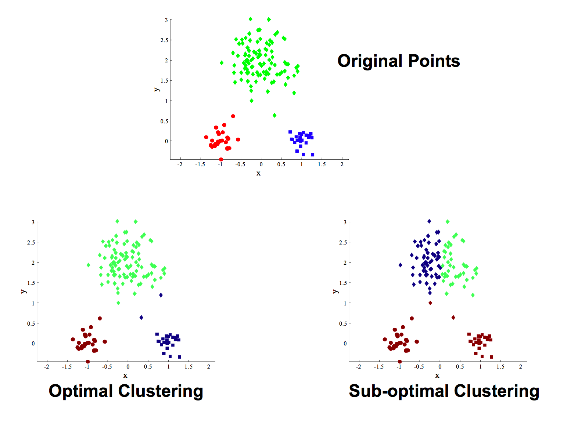
```

# From one set of initial centroids


```{r, out.width = "300px", fig.align='center', echo=FALSE}
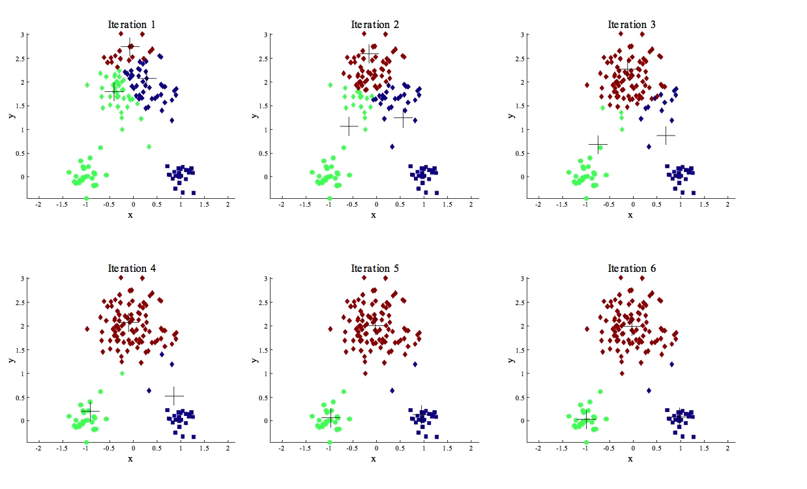
```

# From a different set of initial centroids


```{r, out.width = "300px", fig.align='center', echo=FALSE}
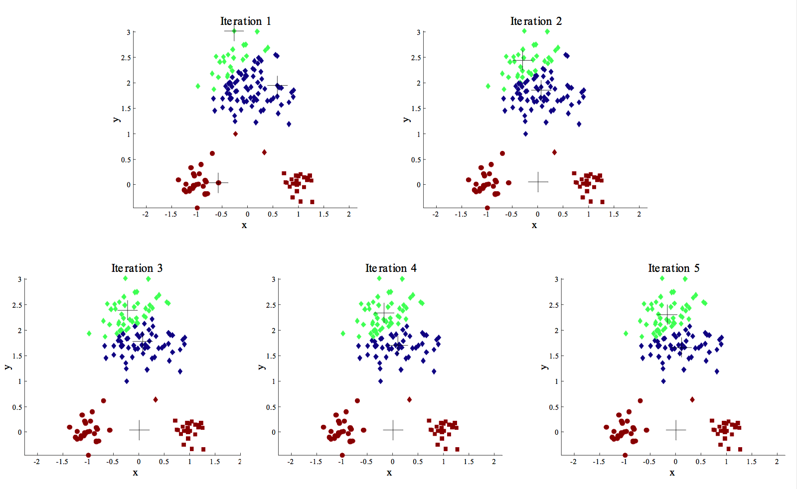
```

# Ten initial centroids


```{r, out.width = "250px", fig.align='center', echo=FALSE}
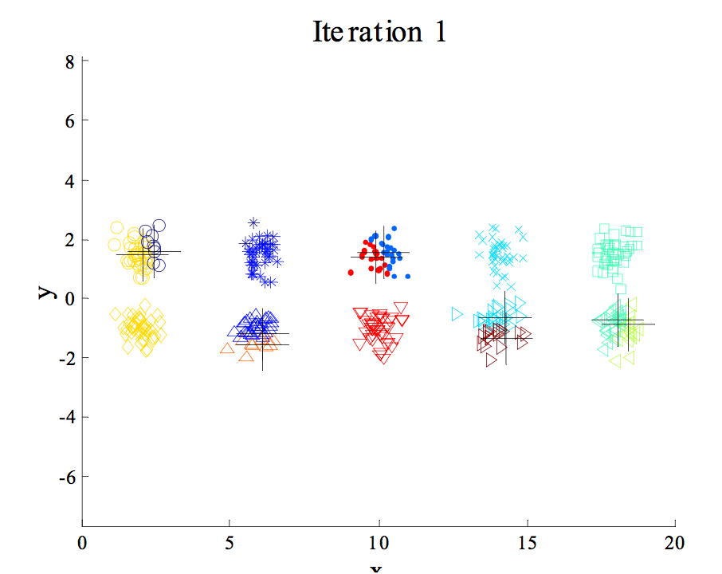
```

Each pair of clusters has two initial centroids.  


# Ten initial centroids


```{r, out.width = "275px", fig.align='center', echo=FALSE}
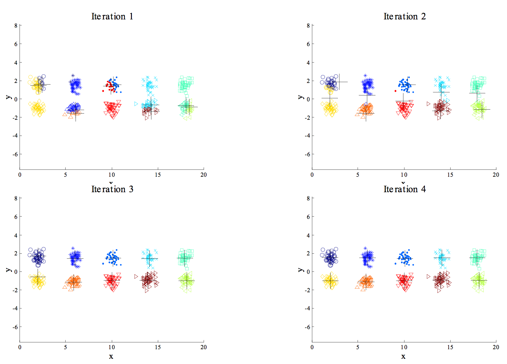
```

Not bad!


# Ten initial centroids: another try


```{r, out.width = "250px", fig.align='center', echo=FALSE}
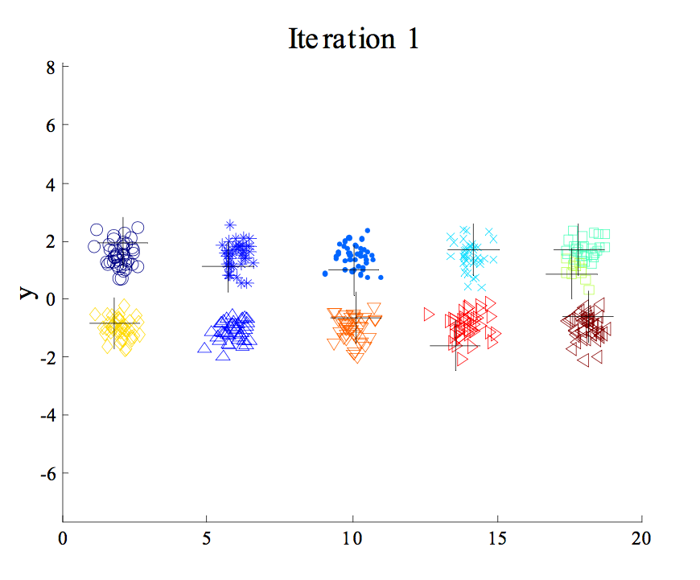
```

Now one pair of clusters has one centroid (another pair has three).  


# Ten initial centroids: another try


```{r, out.width = "275px", fig.align='center', echo=FALSE}
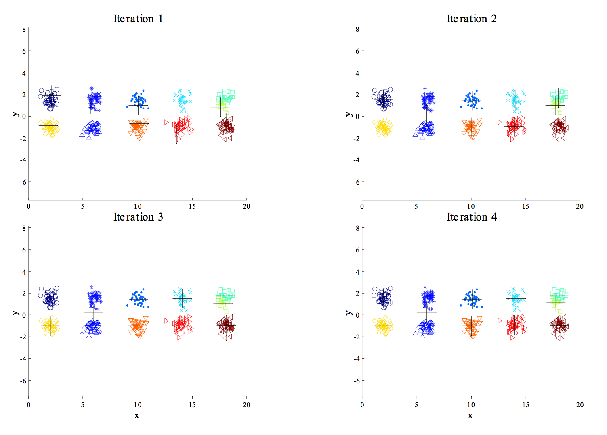
```
Not as good!


# Solutions to "Initial Centroids" Problem


- Multiple restarts (might help, but probability not on your side)  

- Select more than K initial centroids and then select the most widely separated among these initial centroids

- Postprocessing

- Different initialization strategies (e.g. K-means++)  
- Sample and use hierarchical clustering to determine initial centroids (sampling reduces computational cost of hierarchical clustering)


# K-means++

Here's now K-means++ initialization works:  

- Initialize by choosing 1 centroid at random, $m_1$.  

- Then for $k=2, \ldots, K$:  

   1) For each point, compute $d_i$ as the minimum distance of $x_i$ to the existing centroids.  
   2) Choose $x_i$ as initial centroid $k$ with probability proportional to $d_i^2$.  

Thus points that are far away from existing cluster centroids are more likely to get chosen.

Note: this is just a different initialization strategy.  After initialization, it works the same as K-means.  


# K-means++: a cartoon


# K-means: evaluating in-sample fit


Let $m_k$ be cluster centroid $k$, and let $C_k$ be the set of points in cluster $k$ (i.e. for which $\gamma_i = k$).    Two properties of a "well-fitting" clustering:  

- Within-cluster sum of squares should be low:
$$
\mbox{SSE}_W =  \sum_{k=1}^K \sum_{x_i \in C_k} d(m_k, x_i)^2
$$

- Between-cluster sum of squares should be high:
$$
\mbox{SSE}_B =  \sum_{k=1}^K  d(m_k, \bar{x})^2
$$
where $\bar{x}$ is the overall sample mean.  


# K-means: example


Let's see an example in `cars.R`.


# K-means only finds a local optimum  

K-means tries to minimize within-cluster SSE.  But:  
  
- It basically never finds a global optimizer, except in simple problems.  
- There are too many possible clusterings to check them all!  
  
$$
\begin{aligned}
A(N, K) &= \mbox{No. of assignments of N points to K groups} \\
&= \frac{1}{K!} \sum_{j=1}^K (-1)^{K-j} \cdot \binom{K}{j} \cdot j^N  \\
  \\
A(10, 4) &= 34,105 \\
A(25, 4) &\approx 5 \times 10^{13}
\end{aligned}
$$

    
   

# The geometry of K-means


Let $m_1, \ldots, m_K$ be the cluster centroids, and define  

$$
  V_k = \{x \in \mathcal{R}^D : d(x - m_k) \leq d(x, m_j) \; \mathrm{for } j = 1, \ldots, K  \}
$$
    
```{r, out.width = "200px", fig.align='center', echo=FALSE}
  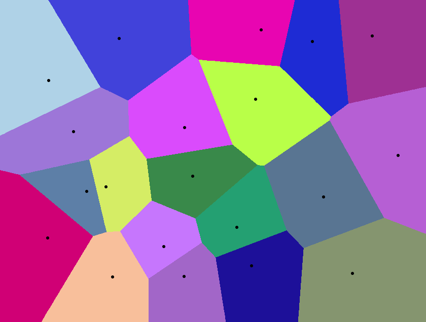
```
  
  
# The geometry of K-means
  
  
These $V_k$ are convex polyhedra, and they form something called a _Voronoi tesselation._  
  
Upshot: K-means will not successfully recover clusters of points that aren't shaped, basically, like a convex polyhedron (no rings, arcs, amoeba-like blobs, bananas, etc.)

K-means is best at recovering clusters shaped like multivariate Gaussians.     

__But__: k-means can often be successfully applied in conjunction with another algorithm to find non-convex clusters.  


# Choosing K


Remember: K is an _input_ to K-means, not an estimated parameter.  __There is no generally accepted "best" method for choosing K,__ and there never will be.  Recall this example:

\bigskip

```{r, out.width = "225px", fig.align='center', echo=FALSE}

```


# Choosing K


Unlike in supervised learning, we can't really cross validate, because we don't know the "true" cluster labels of points in a training set.

Some heuristics that people use in practice:

- choose it in advance based on prior knowledge or prior utility 
- find the "elbow" on a plot of $SSE_W$ versus $K$.  
- optimize one of many quantitative model-selection criteria (CH index, AIC, BIC, gap statistic...)


# Choosing K


But probably the most popular principle is this:

- satisfice, don't optimize: pick a value of $K$ that gives clusters you and your stakeholders can interpret, and call it a day.  
- __There is absolutely no shame in this, and smart people do it all the time.__
  
    
# Elbow plot
    
    
Let's try many clustering with many different values of K:

\bigskip

\small
```{r, message=FALSE, echo=TRUE}
library(foreach)
cars = read.csv('../data/cars.csv')
X = scale(cars[,10:18]) # cluster on measurables
k_grid = seq(2, 30, by=1)
SSE_grid = foreach(k = k_grid, .combine='c') %do% {
  cluster_k = kmeans(X, k, nstart=50)
  cluster_k$tot.withinss
}
```

Let's draw a cartoon of what this is "supposed to" look like.  


# Elbow plot: cartoon  
 
 
# Elbow plot: reality

```{r, fig.width = 4, fig.asp = 0.85, fig.align='center', message=FALSE}
plot(k_grid, SSE_grid) 
```

Do you see an elbow?

# Elbow plot: reality

```{r, out.width = "300px", fig.align='center', echo=FALSE}

```

A lot of elbow plots I've seen look more or less like this.

Your mileage may vary!  

# CH index


The CH index is just one of many model-selection criteria that people have proposed for choosing K in K-means clustering.  It tries to balance fit with simplicity.  

Let $n_j$ be the number of points in cluster $j$, and define
$$
\begin{aligned}
B(K) &= \sum_{j=1}^K n_j d(m_j, \bar{x})^2 \quad \mbox{("between")} \\
W(K) &= \sum_{j=1}^K \sum_{x_i \in C_j} d(x_i, m_j)^2 \quad \mbox{("within")}
\end{aligned}
$$


# CH index


The CH-index is defined as
$$
CH(K) = \frac{B(K)}{W(K)} \cdot \frac{N-K}{K-1}
$$

- The first term, $B(K)/W(K)$ gets larger as $K$ gets larger (better fit).  
- The second term, $(N-K)/(K-1)$ gets smaller as $K$ gets larger (more complex model).  

So choose $\hat{K} = \arg \max CH(K)$.  

If you know about $F$-tests in regression and ANOVA, this statistic might look familiar.  

# CH index

Here we are computing CH index across our grid of $K$:

\small
```{r, echo=TRUE, message=FALSE}
N = nrow(X)
CH_grid = foreach(k = k_grid, .combine='c') %do% {
  cluster_k = kmeans(X, k, nstart=50)
  W = cluster_k$tot.withinss
  B = cluster_k$betweenss
  CH = (B/W)*((N-k)/(k-1))
  CH 
}
```

# CH index

```{r, fig.width = 4, fig.asp = 0.85, fig.align='center', message=FALSE}
plot(k_grid, CH_grid, las=1)
```

Don't take "highest is best" too literally because these numbers are noisy.  Focus more on the topography rather than the absolute peak.


# Gap statistic

Another popular method for choosing $K$ is the gap statistic:

- find a way to standardize the comparison of $W_K$ (or actually, $\log W_K$) with a reference or "null" reference distribution of the data, i.e. a distribution with no obvious clustering.  
- The further $\log W_k$ falls the farthest below this reference curve, the better the clustering.  This information is contained in the following formula for the gap statistic:

$$
\mathrm{Gap}_n(K) = E^{\star}_n [ \log W_K ] - \log W_{K}
$$
Here the expected value is taken under the "null" assumpion of no clustering, i.e. where data points are distributed uniformly within the bounding box of the original data.\footnote{The details are fiddly here; see the `clusGap` function in the `cluster` package, particularly the `method` argument.}  

# Gap statistic


```{r, fig.width = 4, fig.asp = 0.7, fig.align='center', message=FALSE}
library(cluster)
cars_gap = clusGap(X, FUN = kmeans, nstart = 50, K.max = 10, B = 50)
plot(cars_gap, cex.main=0.7, cex.axis=0.7, cex.lab=0.7, las=1)
```

The default selection method basically just looks for the first local peak, up to the standard error in estimating $E^{\star}_n [ \log W_K ]$.

Here that's at K=5.  

# Gap statistic: output


\footnotesize
```{r}
cars_gap
```
\normalsize

\bigskip

The output helpfully tells you.


# Summary of K-means

Pros and cons:  

- Good for convex-shaped clusters, but less good for other shapes  
- Have to choose K and no obvious way to do it
- Super fast, super scalable, and kinda, sorta effective
- Usually the first thing that people try in a clustering problem  

Note: I've generally had the most luck with the gap statistic as a model-selection heuristic.  But don't be afraid to just pick a value of $K$ that seems reasonable to you!  

__To sum up, I'll tell you my Spotify K-means story.__


# Hierarchical clustering

Hierarchical clustering is, well, just what it sounds like.  

- Produces a set of nested clusters organized hierarchically
- The result can be visualized as a "dendrogram", a tree diagram that records the sequences of merges or splits:

```{r, out.width = "275px", fig.align='center', echo=FALSE}
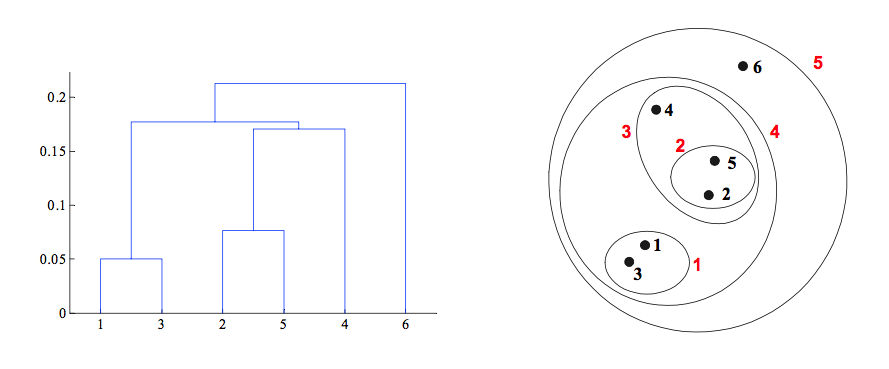
```


# Strengths of hierarchical clustering


You don't have to assume any particular number of clusters.  

- Any desired number of clusters can be obtained from a dendogram.
- Just "cut" the tree at the proper level--- we'll see what this means soon.   

The hierarchy itself may correspond to meaningful taxonomies:  

- the tree of life   
- languages  
- etc.  

# For example


```{r, out.width = "300px", fig.align='center', echo=FALSE}
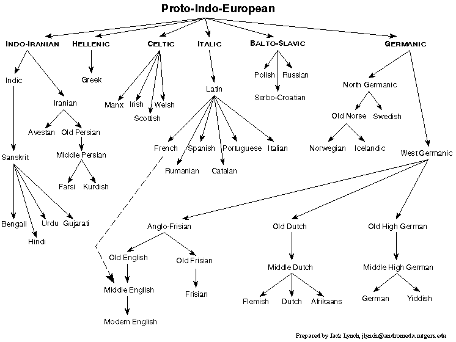
```


# Hierarchical clustering


Two main types of hierarchical clustering

- Agglomerative:  

  1. Start with the points as individual clusters  
  2. At each step, merge the closest pair of clusters until only one cluster (or k clusters) left  

- Divisive:  

  1. Start with one, all-inclusive cluster  
  2. At each step, split a cluster until each cluster contains a point (or there are k clusters)  


# Agglomerative clustering


The basic algorithm is straightforward: start with every point in its own cluster and compute a proximity matrix $D(i, j)$ between every pair of points $i$ and $j$.  

- Then repeat:  
   1. Merge the two closest clusters.   
   2. Update the proximity matrix.  
- Until only a single cluster remains.  

Key operation is the computation of the proximity of two clusters.  Different approaches to defining the distance between clusters distinguish the different algorithms.  


# Agglomerative clustering


Start with a bunch of points and a proximity matrix:  
  
```{r, out.width = "300px", fig.align='center', echo=FALSE}
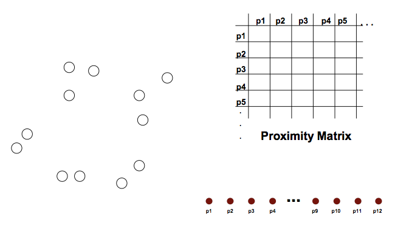
```


# Agglomerative clustering


After some merging steps, we have a handful of clusters:
  
```{r, out.width = "300px", fig.align='center', echo=FALSE}
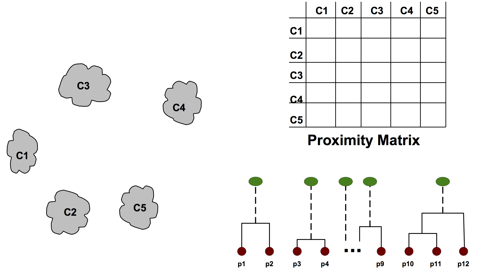
```


# Agglomerative clustering


We want to merge C2 and C5 and update the proximity matrix:
  
```{r, out.width = "300px", fig.align='center', echo=FALSE}
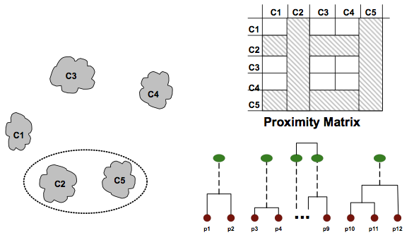
```

# Agglomerative clustering


But how?
  
```{r, out.width = "300px", fig.align='center', echo=FALSE}
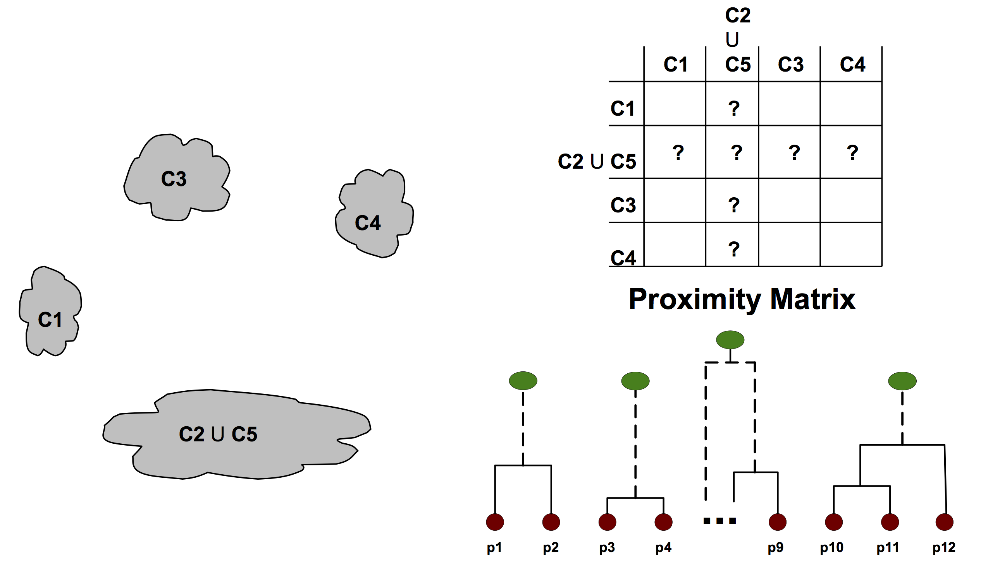
```


# Agglomerative clustering


The key math question is: how do we measure similarity/distance between two clusters of points?
  
```{r, out.width = "300px", fig.align='center', echo=FALSE}
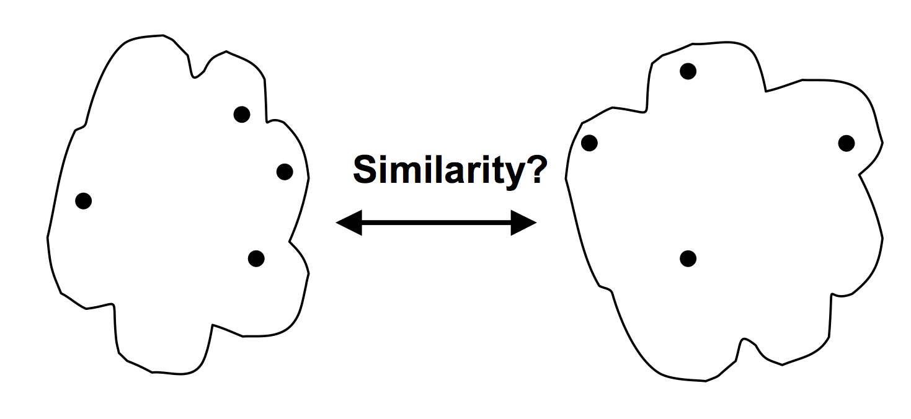
```

Four obvious options: min, max, average, centroids.  There are called "linkage functions" (for historical reasons having to do with the application of these ideas in statistical genetics).   


# Min linkage ("single" in R)


```{r, out.width = "275px", fig.align='center', echo=FALSE}
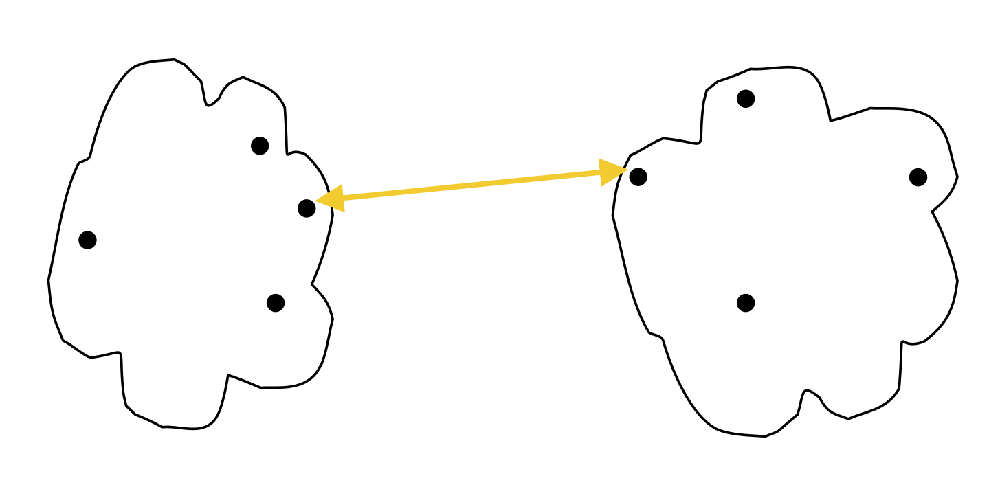
```

The minimum distance between two points, one in each cluster.  


# Max linkage ("complete" in R)


```{r, out.width = "275px", fig.align='center', echo=FALSE}
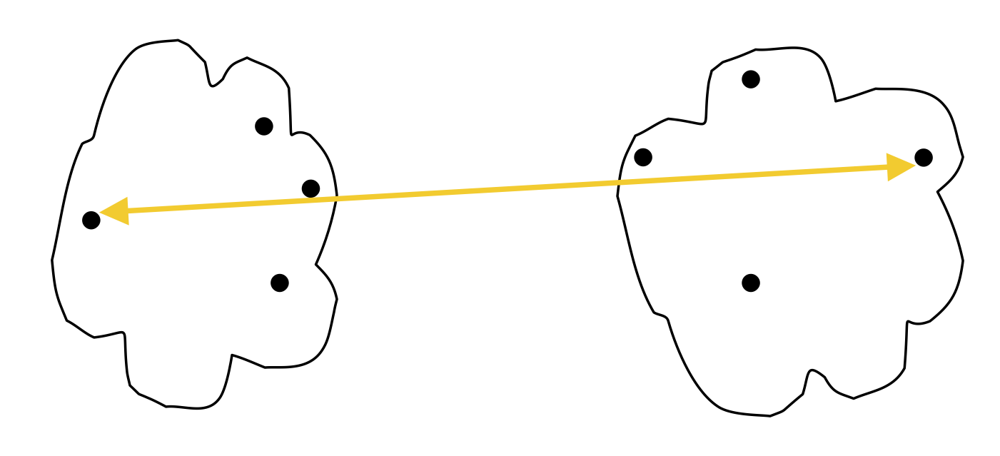
```

The maximum distance between two points, one in each cluster.  


# Average linkage ("average" in R)


```{r, out.width = "275px", fig.align='center', echo=FALSE}
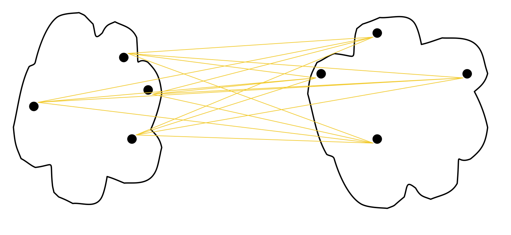
```

The average distance between all pairs of points, one in each cluster.  


# Centroid linkage ("centroid" in R)


```{r, out.width = "275px", fig.align='center', echo=FALSE}
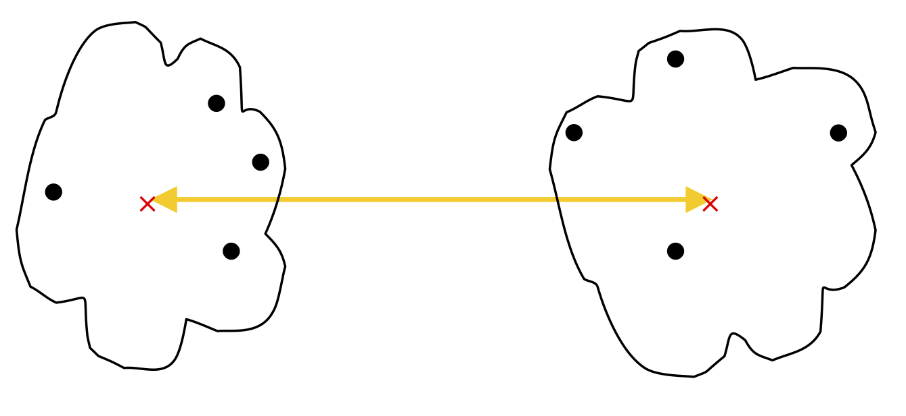
```

The distance between the centroids of each cluster.  


# Choice of linkage function


Each has its own pros and cons:  

- Min: more sensitive to noise and outliers, but will leave large, obvious clusters mostly intact   
- Max: more robust to noise and outliers, but tends to break up large clusters  
- Average and centroid: kind of a compromise between the two    

See `linkage_minmax.R` and `hclust_examples.R`, where we'll see these ideas in action and show how to get a desired number of clusters by "cutting" the dendrogram.  

# Agglomerative clustering: a few facts


- $O(N^2)$ space, since the proximity matrix must be stored  
- Can be as slow as $O(N^3)$ in time, since there are $N$ steps and each step might take $O(N^2)$ time to update the proximity matrix.  
- All the same model-selection criteria for choosing K in K-means also work for choosing where to cut the tree in hierarchical clustering.  


# Spectral Clustering

Spectral clustering is an unsupervised machine learning technique for partitioning data into groups or clusters based on their similarity. It is particularly effective for discovering non-linear relationships in the data.

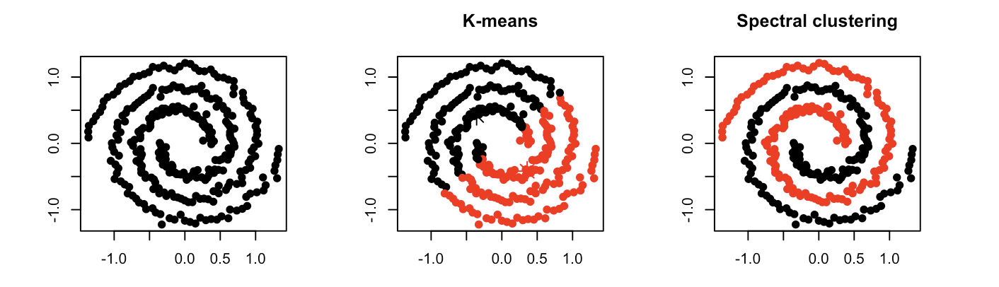

# Key Concepts

1. Adjacency Matrix
2. Laplacian Matrix
3. Eigenvalues & Eigenvectors
4. Clustering Algorithm (e.g., K-means)

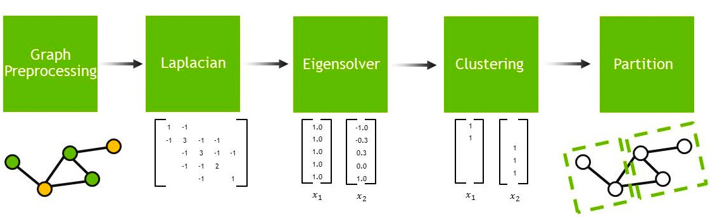

# Step 1: Adjacency Matrix

We start by creating an adjacency matrix ($A$) from the data, e.g. based on a K nearest neighbor graph. The adjacency matrix tells us which data points are close to each other.  In simple terms:

- $A_{ij} = 1$ if data points $i$ and $j$ are "close" (e.g. connected on the KNN graph).  
- $A_{ij} = 0$ otherwise

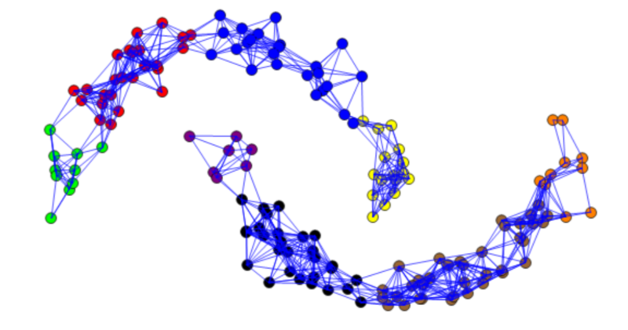{height=30%}

# Step 1: Adjacency Matrix

The adjacency matrix encodes more "topological" information than pairwise differences by focusing on relationships among data points.

- Instead of measuring the raw distances between points, the adjacency matrix captures the local neighborhood structure, highlighting connections and disconnections between data points.
- This approach is more sensitive to the overall shape of the data and can better reveal complex, non-linear patterns.


# Step 2: Laplacian Matrix

Compute the Laplacian Matrix (L) using the adjacency matrix (A) and the degree matrix (D).

$$
D_{ii} = \text{degree of node i}
$$

$$
L = D - A
$$

The Laplacian matrix is a representation of the graph that captures both the connectivity and the degrees of the nodes. It can be seen as a discrete analogue of the Laplace operator, which is used in Fourier analysis to study the frequency domain of functions.

Spectral clustering leverages this connection to reveal the underlying structure of the data.


# Step 3: Eigenvalues & Eigenvectors

Compute the eigenvalues and eigenvectors of the Laplacian Matrix (L).

- Sort the eigenvalues in ascending order
- Select the k smallest eigenvalues and their corresponding eigenvectors

This step can be related to Fourier analysis, where the smallest eigenvalues and their corresponding eigenvectors reveal the "low-frequency structure" of the data across the graph, which is used for clustering.

# Step 4: Clustering Algorithm

The intuition is pretty hard here.

At a high level, each eigenvector of $L$ represents a single feature, observed at each node in the graph, that encodes the adjacency structure of the data.  $K$ eigenvectors means $K$ features.  

So now we just use any clustering algorithm, such as K-means, using the eigenvector features instead of the original data features.  

Let's see `spectral_cluster.ipynb`.
